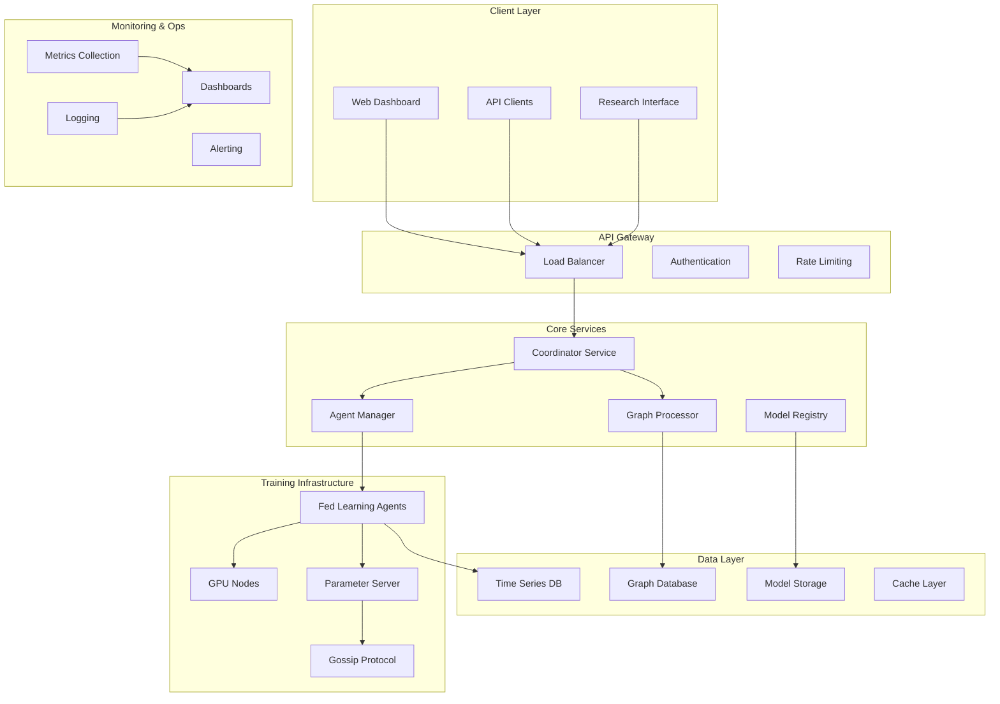

# Architecture Documentation

## Overview

Dynamic Graph Fed-RL is a distributed federated reinforcement learning system designed for time-evolving graph environments. The architecture is built around scalability, fault tolerance, and real-time adaptability.

## High-Level Architecture



## Component Details

### 1. Coordinator Service
**Purpose**: Central orchestration and experiment management
**Technologies**: Python, FastAPI, AsyncIO
**Key Features**:
- Experiment lifecycle management
- Agent registration and health monitoring
- Configuration distribution
- Results aggregation

### 2. Federated Learning Agents
**Purpose**: Distributed training nodes
**Technologies**: JAX, PyTorch Geometric, Ray
**Key Features**:
- Local model training
- Asynchronous parameter updates
- Graph neural network processing
- Dynamic topology adaptation

### 3. Graph Processor
**Purpose**: Real-time graph processing and analysis
**Technologies**: NetworkX, JAX, Neo4j
**Key Features**:
- Temporal graph storage
- Topology change detection
- Graph feature extraction
- Distributed graph analytics

### 4. Parameter Server & Gossip Protocol
**Purpose**: Decentralized parameter sharing
**Technologies**: Redis, gRPC, Protocol Buffers
**Key Features**:
- Asynchronous aggregation
- Byzantine fault tolerance
- Compression and sparsification
- Network topology awareness

## Data Flow Architecture

### Training Loop Flow
1. **Environment Interaction**: Agents interact with dynamic graph environments
2. **Local Training**: Each agent performs local policy updates
3. **Parameter Sharing**: Gossip protocol exchanges parameters
4. **Aggregation**: Distributed averaging with Byzantine robustness
5. **Model Update**: Agents update local models with aggregated parameters

### Graph Update Flow
1. **Topology Detection**: Monitor for structural changes
2. **Change Propagation**: Broadcast topology updates
3. **Buffer Management**: Update temporal graph buffers
4. **Feature Recomputation**: Recalculate graph embeddings
5. **Policy Adaptation**: Adjust policies for new topology

## Scalability Design

### Horizontal Scaling
- **Agent Scaling**: Add/remove training agents dynamically
- **Load Balancing**: Distribute computational load across GPU nodes
- **Sharding**: Partition large graphs across multiple processors
- **Replication**: Replicate critical services for availability

### Performance Optimizations
- **Memory Management**: Efficient graph storage and access patterns
- **Computation**: JAX-based acceleration with XLA compilation
- **Communication**: Gradient compression and sparsification
- **Caching**: Multi-level caching for frequent operations

## Security Architecture

### Authentication & Authorization
- **Service-to-Service**: mTLS with certificate rotation
- **API Access**: JWT tokens with role-based permissions
- **Agent Authentication**: Cryptographic agent identities
- **Audit Logging**: Comprehensive security event logging

### Data Protection
- **Encryption**: End-to-end encryption for sensitive data
- **Differential Privacy**: Privacy-preserving parameter sharing
- **Secure Aggregation**: Cryptographically secure parameter averaging
- **Access Control**: Fine-grained permissions system

## Deployment Architecture

### Container Orchestration
- **Kubernetes**: Primary orchestration platform
- **Helm Charts**: Package management and deployment
- **Service Mesh**: Istio for service communication
- **Monitoring**: Prometheus + Grafana stack

### Infrastructure
- **Cloud Provider**: Multi-cloud support (AWS, GCP, Azure)
- **GPU Resources**: Managed GPU node pools
- **Storage**: Distributed storage for models and data
- **Networking**: High-bandwidth, low-latency networking

## Monitoring & Observability

### Metrics Collection
- **System Metrics**: CPU, memory, GPU utilization
- **Application Metrics**: Training progress, convergence rates
- **Network Metrics**: Communication overhead, latency
- **Business Metrics**: Experiment success rates, cost efficiency

### Logging Strategy
- **Structured Logging**: JSON-formatted logs with correlation IDs
- **Centralized Collection**: ELK stack or similar
- **Log Levels**: Appropriate verbosity for different environments
- **Retention Policies**: Automated log rotation and archival

### Alerting
- **Threshold Alerts**: Performance degradation detection
- **Anomaly Detection**: ML-based anomaly identification
- **Escalation Policies**: Multi-level alert routing
- **Incident Response**: Automated remediation where possible

## Development Architecture

### Code Organization
```
src/
├── dynamic_graph_fed_rl/
│   ├── algorithms/        # RL algorithms
│   ├── environments/      # Graph environments
│   ├── federation/        # Federated learning logic
│   ├── models/           # Neural network models
│   ├── utils/            # Utility functions
│   └── server/           # API server
├── tests/
│   ├── unit/             # Unit tests
│   ├── integration/      # Integration tests
│   ├── performance/      # Performance tests
│   └── e2e/              # End-to-end tests
└── docs/                 # Documentation
```

### CI/CD Pipeline
1. **Code Quality**: Linting, formatting, type checking
2. **Testing**: Unit, integration, and performance tests
3. **Security**: Vulnerability scanning and secret detection
4. **Build**: Container image creation and optimization
5. **Deploy**: Automated deployment to staging/production

### Quality Assurance
- **Pre-commit Hooks**: Automated quality checks
- **Code Review**: Mandatory peer review process
- **Documentation**: Comprehensive API and architecture docs
- **Performance Testing**: Regular performance benchmarking

## Future Architecture Considerations

### Scalability Improvements
- **Edge Computing**: Deploy agents on edge devices
- **Hierarchical Federation**: Multi-level federation topology
- **Adaptive Resource Management**: Dynamic resource allocation
- **Cross-Cloud Deployment**: Multi-cloud federation

### Advanced Features
- **Continual Learning**: Online adaptation to new environments
- **Meta-Learning**: Learning to learn across different tasks
- **Causal Discovery**: Understanding causal relationships in graphs
- **Quantum Computing**: Quantum-enhanced optimization algorithms