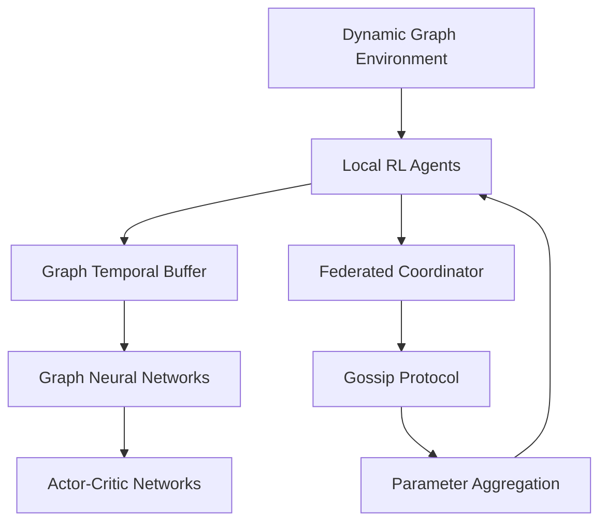

# Architecture Overview

This document outlines the high-level architecture of the Dynamic Graph Federated Reinforcement Learning framework.

## 🏗️ System Design

### Core Components



### 1. Dynamic Graph Environment
- **Purpose**: Simulates time-evolving graph structures
- **Key Features**:
  - Topology changes (edge additions/removals)
  - Node/edge attribute evolution
  - Multi-agent observation spaces
- **Examples**: Traffic networks, power grids, communication networks

### 2. Graph Neural Networks
- **Temporal GNN**: Handles time-varying graph structures
- **Multi-scale Modeling**: Different temporal resolutions
- **Attention Mechanisms**: Focus on critical graph regions
- **Message Passing**: Information propagation across graph

### 3. Federated Learning System
- **Asynchronous Updates**: Non-blocking parameter exchange
- **Gossip Protocol**: Decentralized communication
- **Aggregation Strategies**: FedAvg, FedProx, adaptive methods
- **Privacy Preservation**: Local training, parameter sharing only

### 4. Replay Buffer Design
- **Graph Storage**: Efficient temporal graph representations
- **Temporal Indexing**: Fast sequence retrieval
- **Topology-aware Sampling**: Respect structural changes
- **Memory Management**: Compressed graph storage

## 📊 Data Flow

### Training Loop
1. **Environment Step**: Each agent observes local subgraph
2. **Action Selection**: GNN processes graph → policy outputs action
3. **Experience Storage**: Graph transition stored in temporal buffer
4. **Local Learning**: Agent updates using graph-aware loss
5. **Federated Sync**: Periodic parameter aggregation via gossip
6. **Global Convergence**: System-wide policy improvement

### Graph Representation
```python
GraphState = {
    'nodes': jnp.array,      # Node features [N, node_dim]
    'edges': jnp.array,      # Edge indices [2, E] 
    'edge_attr': jnp.array,  # Edge features [E, edge_dim]
    'global_attr': jnp.array, # Global features [global_dim]
    'timestamp': float,       # Time information
    'topology_hash': str      # Structural fingerprint
}
```

## 🔧 Key Algorithms

### 1. Graph TD3 (Twin Delayed Deep Deterministic)
- **Actor**: GNN → policy mapping
- **Critics**: Dual Q-networks for stability
- **Target Networks**: Delayed updates for consistency
- **Graph-aware Experience Replay**: Topology-consistent sampling

### 2. Graph SAC (Soft Actor-Critic)
- **Entropy Regularization**: Exploration in graph action spaces
- **Automatic Temperature Tuning**: Adaptive exploration
- **Safety Constraints**: Infrastructure-specific limitations
- **Hierarchical Control**: Multi-level decision making

### 3. Asynchronous Gossip Federation
- **Random Neighbor Selection**: Decentralized topology
- **Weighted Aggregation**: Performance-based weighting
- **Staleness Handling**: Version-aware parameter mixing
- **Byzantine Tolerance**: Robust to faulty agents

## 🚀 Performance Optimizations

### JAX Integration
- **JIT Compilation**: Accelerated graph operations
- **Vectorization**: Batch processing across agents
- **GPU Memory**: Efficient tensor management
- **Automatic Differentiation**: Fast gradient computation

### Scalability Features
- **Distributed Training**: Multi-node coordination
- **Model Parallelism**: Large graph partitioning
- **Communication Compression**: Gradient sparsification
- **Adaptive Synchronization**: Load-balanced updates

## 🔒 Security Considerations

### Threat Model
- **Model Poisoning**: Malicious parameter updates
- **Data Inference**: Reverse engineering from parameters
- **Communication Attacks**: Man-in-the-middle interception
- **Resource Exhaustion**: DoS attacks on coordination

### Mitigation Strategies
- **Byzantine-robust Aggregation**: Outlier detection
- **Differential Privacy**: Noise injection in parameters
- **Secure Communication**: Encrypted parameter exchange
- **Anomaly Detection**: Statistical validation of updates

## 📈 Monitoring & Observability

### Key Metrics
- **Learning Progress**: Episode rewards, convergence rates
- **Graph Dynamics**: Topology change frequency, node churn
- **Federation Health**: Communication overhead, staleness
- **Resource Utilization**: GPU memory, network bandwidth

### Integration Points
- **Prometheus**: Metrics collection and alerting
- **Grafana**: Real-time dashboards
- **TensorBoard**: Training visualization
- **Weights & Biases**: Experiment tracking

This architecture provides a scalable, secure foundation for federated learning on dynamic graphs while maintaining flexibility for diverse infrastructure control applications.